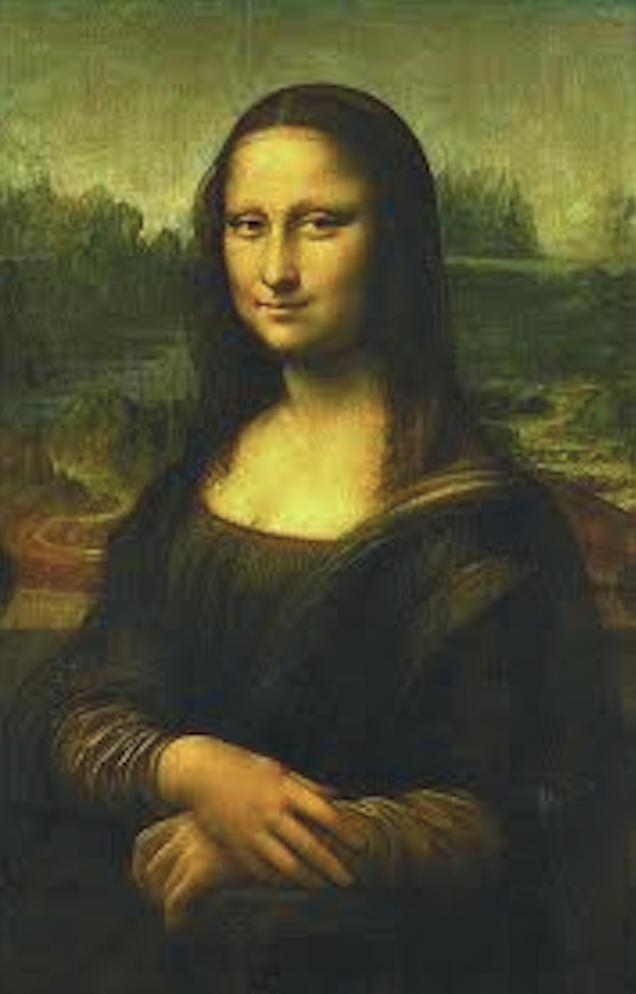
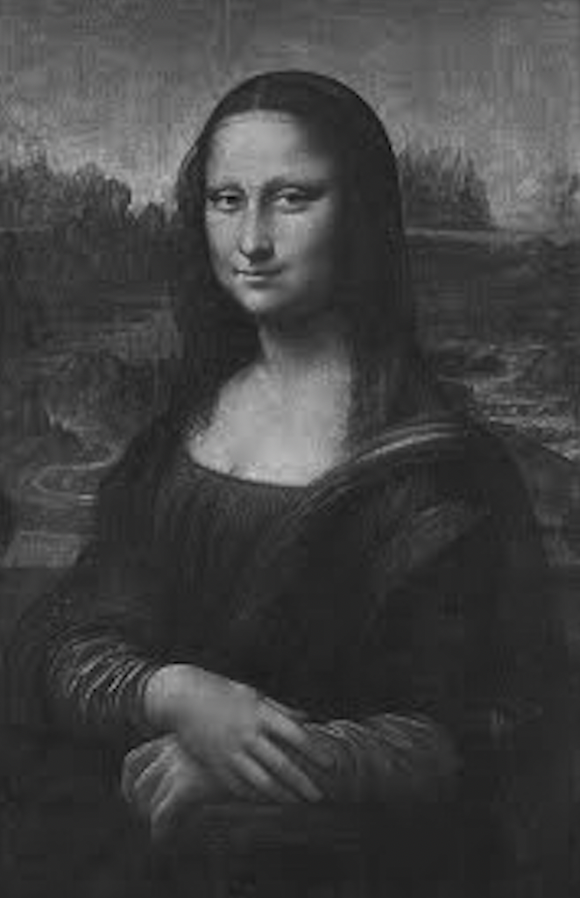
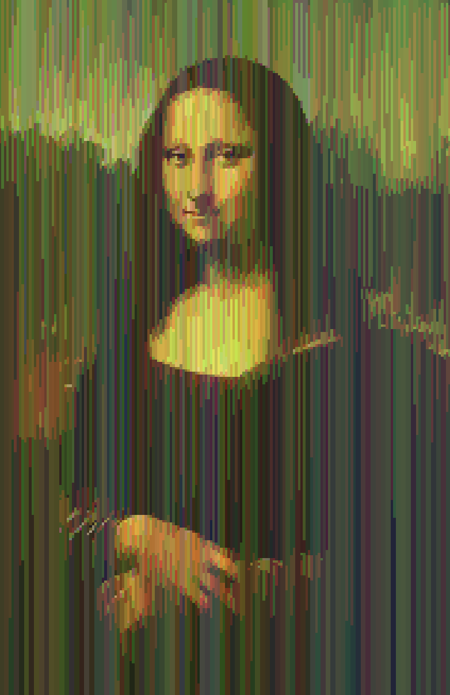

# Operations-with-images

🌁 PPM image operations icluding 7 different filters (like black/white filter and so on)

For example

Here is the original picture:

Here is the picture with black&white filer:

Here is another filter:

